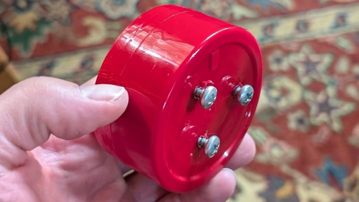

# NateChurch's esphome

## Summary

I wanted to share my leak sensor project and realized that in so doing I was going to share my folder design. I created it this way, so if I decide to demostrate another project they can share this as a home and make my life easier. Documentation is in the [Wiki](wiki/README.md). 

## Wiki

Wiki covers everything [Wiki](wiki/README.md)

## Projects

### Leak Sensor

I created a homemade leak sensor out of an esp8266 and a few parts I had laying around.   
[github version](wiki/leak_sensor.md)  
[full article](https://nate.church)  

### Wyze Outdoor Plug

Need to update the wiki on this one.   

[github](wiki/wyze_outdoor_plug.md)  
[full article](https://nate.church/content/wyze-outdoor-plug/)  

[wyze outdoor plug](pics/wyze-outdoor-plug-with-wires.16-9.720.jpg)