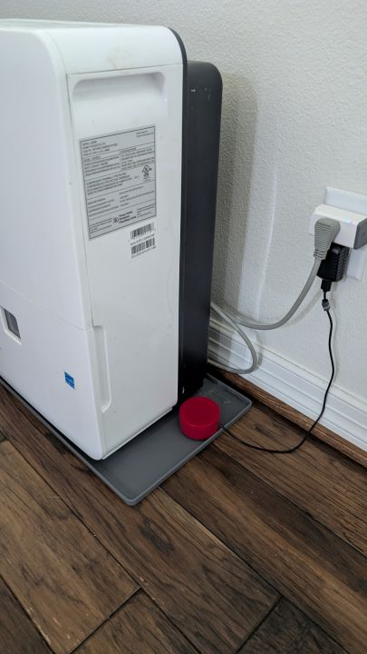
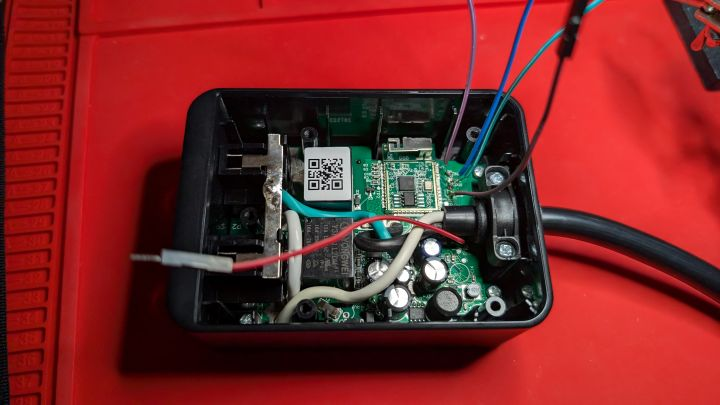

# Wiki

## Summary

This is the wiki that accompanies my esphome sample projects. I talk about what I did and where possible where I got the idea. 

## methodology

My methodology can be found here. [Nate's Methodology](methodology.md)

## Projects

### [Leak Sensor](wiki/leak_sensor.md)

I created a homemade leak sensor out of an esp8266 and a few parts I had laying around. [github](wiki/leak_sensor.md)
[full article](https://nate.church)

### Wyze Outdoor Plug

Need to update the wiki on this one. 

[github](wyze_outdoor_plug.md)
[full article](https://nate.church/content/wyze-outdoor-plug/)

