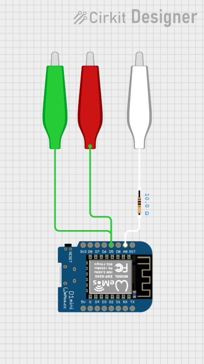
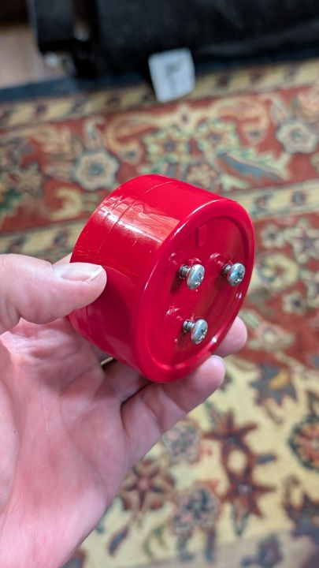
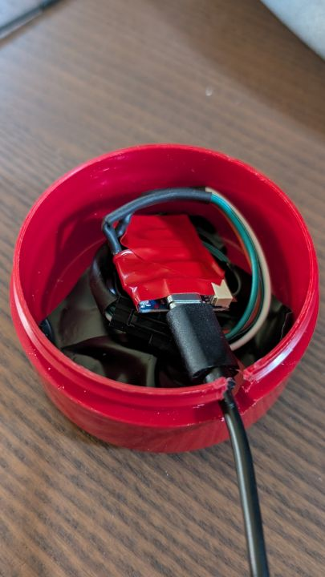
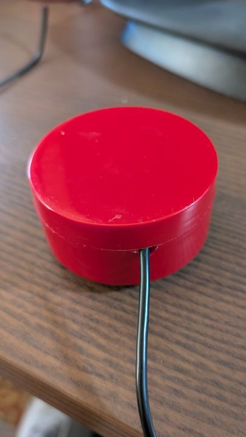

# Leak Sensor

## Summary

My dehumidifier will leak a bit every now and again and so I decided to try and make my own leak sensor using a few parts I had around the house. The goal was to use esphome and homeassistant for automation and notification. For the full story including the battery version and parts list visit my website at [nate.church](https://nate.church)

## Circuit Diagram

[](pics/leak_sensor_circuit.9-16.main.png)

Concept is pretty simple, set D5 (the red wires) to high and listen on A0 (the green wires). A0 is an analog sensor, so it measures how much electricity it receives. Water conducts electricity, so if there is water between any of the red and the green sensor when we measure, A0 will go past our threshold, we will consider it a leak.

## Physical Build

I use Old Spice Hair Paste and I really like their containers. I used one for Halloween to make an Iron Man arch reactor, but that is a different story. I cleaned it up drilled three holes in the bottom and screwed in screws. I then adjusted them so it was level and the Old Spice container is off the ground leaving a gap for water to flow underneath.

[](pics/leak_sensor_screws.9-16.main.jpg)

I then soldered wire to the top of each screw. A quick note here, double check that your screws are conductive. Some of them use fancy alloys and aren’t conductive. I used disconnects which are always a good idea when you are fiddle-farting around. It makes it easier to take it apart and try something else.


[](pics/leak_sensor_drilled.9-16.main.jpg)

I drilled a hole right under the lid for the cable and then opened it up with my dremel to get the cable in. I wrapped the board and connections with electrical tape to prevent shorts and voila. 

[](pics/leak_sensor_corded.9-16.main.jpg)

## esphome

Esphome setup was pretty easy. Here is my configuration file. I did have a buzzer on there initially, but that was annoying. The onboard LED comes on when you use it. 

```yaml
substitutions:
  name: dehumidifier_leak_sensor 
  friendly_name: Dehumidifier Leak Sensor
  icon: "mdi:water-alert"
  area: family_room

  # Update Intervals
  measurement_interval: "10s"
  diagnostic_interval: "300s"
  heartbeat_interval: "10s"

  # Logging Settings
  log_level: "DEBUG" # Log level: NONE, ERROR, WARN, INFO, DEBUG, VERBOSE

  # GPIO Pin Configuration for D1 Mini v4
  gpio_alert_led: D2      # Built-in LED on D1 Mini (D2 pin)
  gpio_buzzer: D1         # D1 on D1 Mini - Safe pin for buzzer
  gpio_power_probe: D5    # D5 on D1 Mini - Your probe power connection
  gpio_sensor_probe: A0   # Analog pin for water detection probe

packages:
  defaults: !include templates/defaults.yaml
  mqtt: !include templates/mqtt.yaml
  common: !include templates/common.yaml
  leak_sensor: !include templates/leak_sensor.yaml
```


The leak sensor template is here. This has all of the code: [leak sensor template](../src/templates/leak_sensor.yaml)

